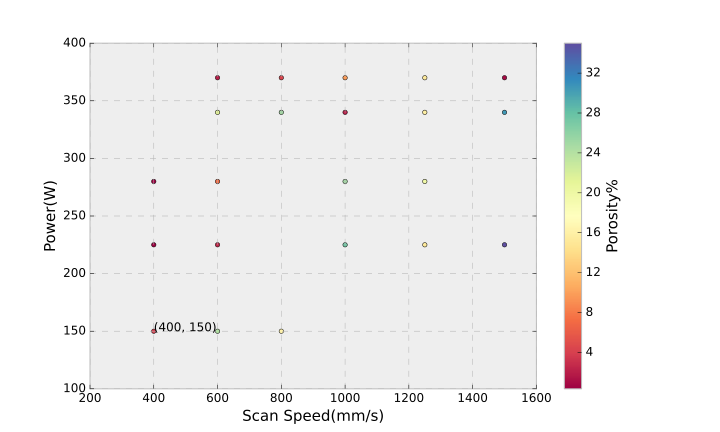

##Microscopy and Python Plotting

### ImageJ Analysis

After all data samples are processed we need to see which printing parameters suit for our alloy. In order to study that we need to plot all the data we have on an excel/scv file in python or java code.
Then we can compare and see how each sample's parameters are best suited for our project going forward. 

. 